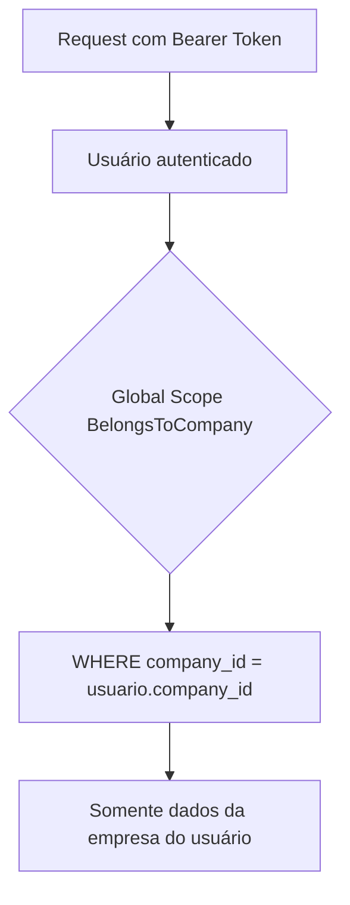
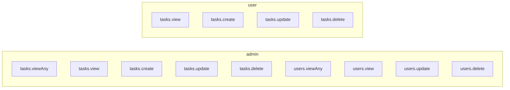
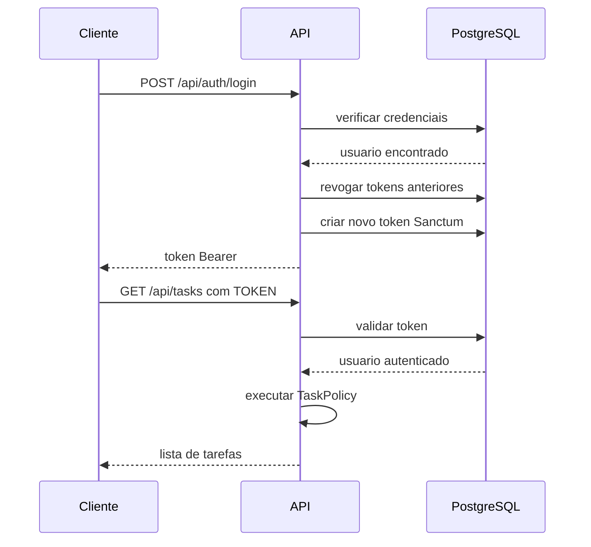
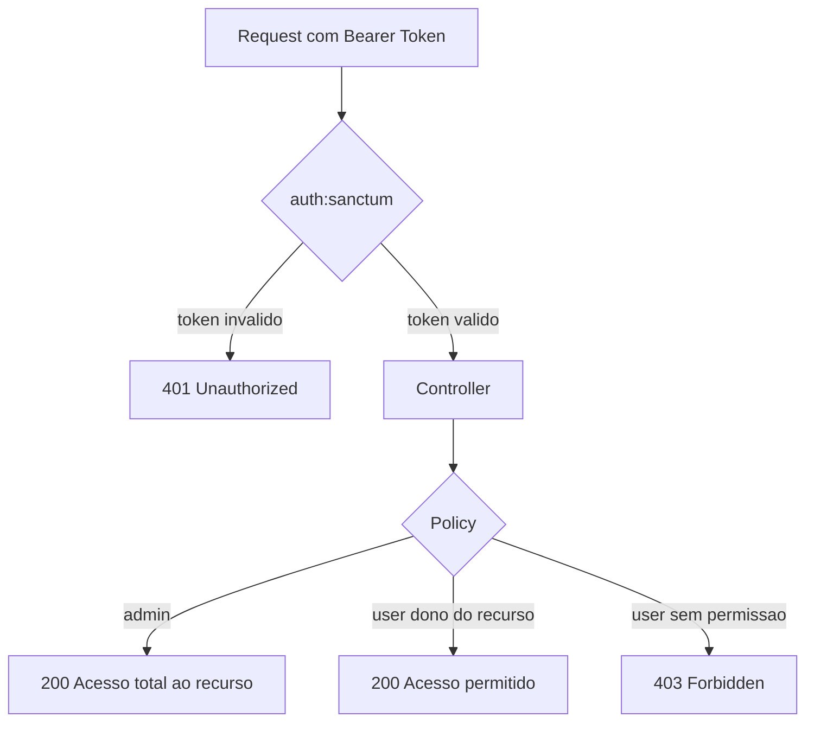
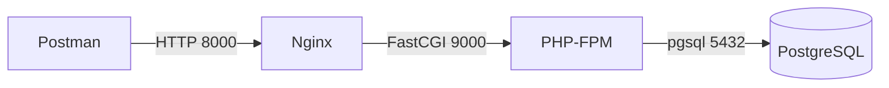

# API Tasks

API REST **multi-tenant** de gerenciamento de tarefas construída com **Laravel 13**, autenticação via **Laravel Sanctum** e controle de acesso com **Spatie Laravel Permission (ACL)**. Ambiente containerizado com **Docker** e banco de dados **PostgreSQL**.

Cada **empresa (tenant)** tem seus dados completamente isolados: usuários e tarefas de uma empresa nunca são visíveis para outra.

---

## Stack

| Camada | Tecnologia |
|---|---|
| Framework | Laravel 13 / PHP 8.3 |
| Autenticação | Laravel Sanctum (Bearer Token) |
| Autorização | Spatie Laravel Permission v6 (Roles + Permissions + Policies) |
| Banco de dados | PostgreSQL 16 |
| Servidor web | Nginx + PHP-FPM |
| Containerização | Docker + Docker Compose |

---

## Como funciona

### Multi-tenancy (isolamento por empresa)

Abordagem adotada: **banco único, schema compartilhado** (*single database, shared schema*). Cada registro de negócio carrega uma coluna `company_id` que identifica o tenant.

- Tabela `companies` é o tenant raiz; `users` e `tasks` possuem `company_id` (FK com `cascadeOnDelete`).
- A trait `App\Models\Concerns\BelongsToCompany` (usada em `User` e `Task`) aplica um **Global Scope** que filtra **toda** query pela empresa do usuário autenticado — nenhuma consulta precisa lembrar de adicionar `where('company_id', ...)`.
- A mesma trait preenche `company_id` automaticamente ao **criar** um registro.
- Como o scope atua na própria query, o *route-model-binding* retorna **404** para recursos de outra empresa (eles simplesmente não existem para aquele tenant).



No **registro** (`POST /api/auth/register`), uma nova empresa é criada e o usuário que a registrou se torna o **admin** dela. Os papéis do Spatie (`admin` / `user`) são globais — o isolamento de dados vem do Global Scope, não dos papéis.

---

### Autenticação

O cliente envia as credenciais (`email` + `password`) para o endpoint de login. A API retorna um **Bearer Token** gerado pelo Sanctum. Todas as rotas protegidas exigem esse token no header `Authorization`.

```
Authorization: Bearer <token>
```

O token é invalidado no logout. No login, todos os tokens anteriores do usuário são revogados e um novo é gerado.

---

### Sistema de Roles e Permissões (ACL)



**Diferença de comportamento por role:**

> Todas as ações abaixo já são restritas à **empresa do usuário** pelo Global Scope. "Todas as tarefas" significa todas as tarefas **da própria empresa**.

| Ação | Admin | User |
|---|---|---|
| Listar tarefas | Vê **todas** as tarefas da empresa | Vê apenas **as suas** |
| Ver tarefa | Qualquer tarefa da empresa | Apenas as suas |
| Criar tarefa | ✅ | ✅ |
| Editar tarefa | Qualquer tarefa da empresa | Apenas as suas |
| Excluir tarefa | Qualquer tarefa da empresa | Apenas as suas |
| Gerenciar usuários | ✅ (da própria empresa) | ❌ (403) |

---

### Fluxo de Autenticação



---

### Fluxo de Autorização (Policy)



---

### Arquitetura dos Containers



---

## Estrutura do Projeto

```
app/
├── Enums/
│   ├── TaskPriority.php     # low | medium | high
│   └── TaskStatus.php       # pending | in_progress | completed
├── Http/
│   ├── Controllers/
│   │   ├── AuthController.php
│   │   ├── TaskController.php
│   │   └── UserController.php
│   ├── Requests/
│   │   ├── Auth/            # LoginRequest, RegisterRequest
│   │   ├── Task/            # StoreTaskRequest, UpdateTaskRequest
│   │   └── User/            # UpdateUserRequest
│   └── Resources/
│       ├── TaskResource.php
│       └── UserResource.php
├── Models/
│   ├── Concerns/
│   │   └── BelongsToCompany.php   # Global Scope + auto company_id (multi-tenant)
│   ├── Company.php                # Tenant raiz
│   ├── Task.php
│   └── User.php
└── Policies/
    ├── TaskPolicy.php
    └── UserPolicy.php
database/
├── migrations/                    # inclui create_companies_table + company_id em users/tasks
└── seeders/
    ├── RoleAndPermissionSeeder.php
    └── UserSeeder.php             # cria 2 empresas demo
docker/
├── nginx/default.conf
└── php/docker-entrypoint.sh
apirest/
└── api-tasks.postman_collection.json
```

---

## Instalação e Execução

### Pré-requisitos

- Docker
- Docker Compose

### Subindo o ambiente

```bash
# Clone o projeto e entre na pasta
git clone <repo-url>
cd api-tasks

# Suba os containers (build + migrate + seed automático)
docker compose up -d --build
```

A API estará disponível em `http://localhost:8000`.

### Comandos úteis (Makefile)

```bash
make setup    # build + sobe containers
make up       # sobe containers existentes
make down     # para containers
make bash     # abre shell no container app
make logs     # exibe logs em tempo real
make fresh    # recria banco do zero (migrate:fresh --seed)
make tinker   # abre Laravel Tinker
make test     # executa os testes
```

---

## Usuários de Seed

O seed cria **duas empresas** para demonstrar o isolamento de dados. Todos usam a senha `password`.

| Empresa | Email | Senha | Role |
|---|---|---|---|
| Example Inc | `admin@example.com` | `password` | admin |
| Example Inc | `user@example.com` | `password` | user |
| Acme Ltda | `admin@acme.com` | `password` | admin |
| Acme Ltda | `user@acme.com` | `password` | user |

> Faça login como `admin@example.com` e depois como `admin@acme.com`: cada um enxerga apenas os usuários e tarefas da própria empresa.

---

## Endpoints

### Auth

| Método | Rota | Autenticação | Descrição |
|---|---|---|---|
| `POST` | `/api/auth/register` | ❌ | Cria uma **empresa** + usuário `admin` dela |
| `POST` | `/api/auth/login` | ❌ | Autentica e retorna Bearer Token |
| `GET` | `/api/auth/me` | ✅ | Dados do usuário autenticado |
| `POST` | `/api/auth/logout` | ✅ | Revoga o token atual |

#### POST /api/auth/register

Cria uma nova empresa (tenant) e o usuário que a registra como **admin** dela.

```json
// Request
{
  "company_name": "Minha Empresa",
  "name": "João Silva",
  "email": "joao@example.com",
  "password": "password",
  "password_confirmation": "password"
}

// Response 201
{
  "data": {
    "id": 5,
    "name": "João Silva",
    "email": "joao@example.com",
    "roles": ["admin"],
    "company": { "id": 3, "name": "Minha Empresa" }
  },
  "token": "1|abc123...",
  "message": "Empresa e usuário registrados com sucesso."
}
```

#### POST /api/auth/login

```json
// Request
{
  "email": "admin@example.com",
  "password": "password"
}

// Response 200
{
  "data": { "id": 1, "name": "Admin", "email": "admin@example.com", "roles": ["admin"] },
  "token": "2|xyz456...",
  "message": "Login realizado com sucesso."
}
```

---

### Tasks

Todas as rotas exigem `Authorization: Bearer <token>`.

| Método | Rota | Role | Descrição |
|---|---|---|---|
| `GET` | `/api/tasks` | admin / user | Lista tarefas (admin vê todas, user vê as suas) |
| `POST` | `/api/tasks` | admin / user | Cria uma tarefa |
| `GET` | `/api/tasks/{id}` | admin / user | Detalhe de uma tarefa |
| `PUT` | `/api/tasks/{id}` | admin / user | Atualiza uma tarefa |
| `DELETE` | `/api/tasks/{id}` | admin / user | Remove uma tarefa |

#### Filtros disponíveis em GET /api/tasks

| Parâmetro | Valores | Exemplo |
|---|---|---|
| `status` | `pending`, `in_progress`, `completed` | `?status=pending` |
| `priority` | `low`, `medium`, `high` | `?priority=high` |
| `per_page` | número inteiro | `?per_page=10` |

#### POST /api/tasks

```json
// Request
{
  "title": "Implementar OAuth2",
  "description": "Adicionar login social ao sistema",
  "status": "pending",
  "priority": "high",
  "due_date": "2026-12-31"
}

// Response 201
{
  "data": {
    "id": 1,
    "title": "Implementar OAuth2",
    "description": "Adicionar login social ao sistema",
    "status": "pending",
    "priority": "high",
    "due_date": "2026-12-31",
    "user": { "id": 1, "name": "Admin", "email": "admin@example.com" },
    "created_at": "2026-06-20T00:00:00.000000Z",
    "updated_at": "2026-06-20T00:00:00.000000Z"
  },
  "message": "Tarefa criada com sucesso."
}
```

#### Valores aceitos nos Enums

| Campo | Valores |
|---|---|
| `status` | `pending` · `in_progress` · `completed` |
| `priority` | `low` · `medium` · `high` |

---

### Users (somente Admin)

| Método | Rota | Descrição |
|---|---|---|
| `GET` | `/api/users` | Lista todos os usuários |
| `GET` | `/api/users/{id}` | Detalhe de um usuário |
| `PUT` | `/api/users/{id}` | Atualiza dados e/ou role |
| `DELETE` | `/api/users/{id}` | Remove um usuário |

#### PUT /api/users/{id} — Troca de role

```json
// Request
{
  "role": "admin"
}

// Response 200
{
  "data": { "id": 2, "name": "User", "email": "user@example.com", "roles": ["admin"] },
  "message": "Usuário atualizado com sucesso."
}
```

---

### Respostas de erro

| Código | Situação |
|---|---|
| `401` | Token ausente ou inválido |
| `403` | Sem permissão para o recurso |
| `404` | Recurso não encontrado |
| `422` | Erro de validação nos campos |

```json
// 422 Unprocessable Entity
{
  "message": "The title field is required.",
  "errors": {
    "title": ["The title field is required."]
  }
}
```

---

## Importar no Postman / Insomnia

O arquivo de collection está em `apirest/api-tasks.postman_collection.json`.

- **Postman:** File → Import → selecione o arquivo
- **Insomnia:** Application → Preferences → Data → Import Data → From File

O token é preenchido automaticamente após Login ou Register.

---

## Licença

MIT
